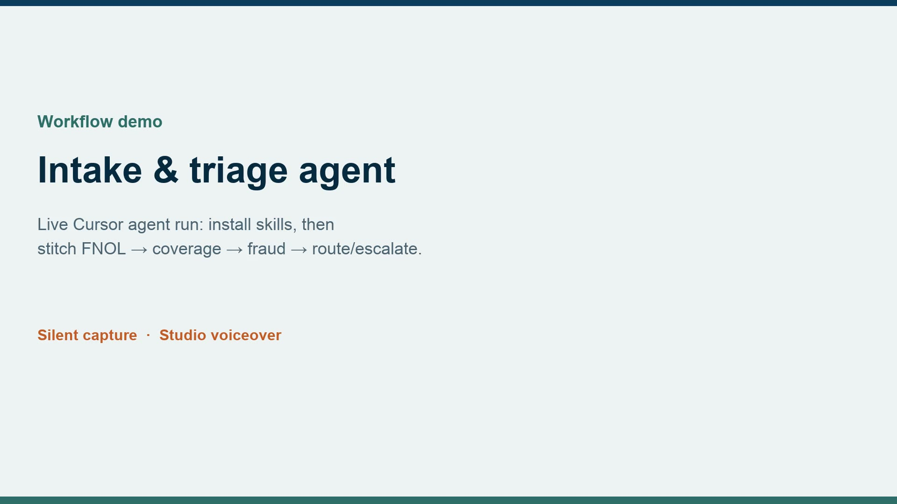

<p align="center">
  <strong>Insurance Agent Skills</strong><br/>
  Agent skills for the modern insurance desk — underwriting, claims, customer, compliance, and more.
</p>

<p align="center">
  <a href="https://letslego.github.io/insurance-agent-skills/"></a>
  <a href="LICENSE"></a>
  <a href="https://github.com/letslego/insurance-agent-skills"></a>
</p>

# Insurance Agent Skills

Forty installable agent skills for carriers and agencies — built for personal-lines and commercial insurance desks.

Works with **Claude Code**, **Codex**, **Cursor**, and any [Agent Skills](https://agentskills.io/) harness.

**Docs:** [letslego.github.io/insurance-agent-skills](https://letslego.github.io/insurance-agent-skills/)

> **Decision support only.** Not binding authority, legal advice, actuarial certification, or a substitute for carrier guidelines, your authority matrix, or licensed judgment.

---

## Workflow demo — intake & triage

Real Cursor desktop screen capture (silent) + studio voiceover — install skills and stitch an **intake-and-triage** agent:

`/fnol-intake` → `/coverage-determination` → `/fraud-red-flags` → `/severity-triage` → `/handoff-brief`

[](https://letslego.github.io/insurance-agent-skills/#intake-and-triage-demo)

<p align="center">
  <a href="https://letslego.github.io/insurance-agent-skills/#intake-and-triage-demo"><strong>▶ Watch on GitHub Pages</strong></a>
  &nbsp;·&nbsp;
  <a href="https://letslego.github.io/insurance-agent-skills/video/workflow-intake-triage/intake-and-triage-workflow-demo.mp4"><strong>Play / download MP4</strong></a>
</p>

## Skills catalog video

Narrated walkthrough of all skills (~12 min): when to use each one, and which skills to pair with it.

[](https://letslego.github.io/insurance-agent-skills/#video)

<p align="center">
  <a href="https://letslego.github.io/insurance-agent-skills/#video"><strong>▶ Watch on GitHub Pages</strong></a>
  &nbsp;·&nbsp;
  <a href="https://letslego.github.io/insurance-agent-skills/video/insurance-agent-skills-tour.mp4"><strong>Play / download MP4</strong></a>
  &nbsp;·&nbsp;
  <a href="docs/video/narration-script.md">Narration script</a>
</p>

<video src="https://letslego.github.io/insurance-agent-skills/video/insurance-agent-skills-tour.mp4" controls poster="https://letslego.github.io/insurance-agent-skills/video/poster.jpg" width="100%">
  <a href="https://letslego.github.io/insurance-agent-skills/#video">Watch the video tour</a>
</video>

---

## Install

### Claude Code

In a Claude Code session:

```text
/plugin marketplace add letslego/insurance-agent-skills
/plugin install insurance-agent-skills@insurance-agent-skills
/reload-plugins
```

Then start with `/ask-insurance`, or jump straight to a skill like `/fnol-intake` or `/underwrite-submission`.

CLI:

```bash
claude plugin marketplace add letslego/insurance-agent-skills
claude plugin install insurance-agent-skills@insurance-agent-skills
```

### Codex

**Recommended — skills.sh:**

```bash
npx skills@latest add letslego/insurance-agent-skills
```

**Native Codex plugin:** clone this repo, open Codex `/plugins`, and enable **Insurance Agent Skills** (manifest: [`.codex-plugin/plugin.json`](.codex-plugin/plugin.json)). Local marketplace: [`.agents/plugins/marketplace.json`](.agents/plugins/marketplace.json).

### Cursor and other agents

```bash
npx skills@latest add letslego/insurance-agent-skills
```

Or clone the repo and point your harness at `skills/`.

### After install

1. `/ask-insurance` — router across the whole desk  
2. Keep carrier manuals / authority matrices in context so skills can cite real rules  
3. Prefer focused skills over the full workflow when you already know the question  

---

## Skill packs

### Knowledge & routing
| Skill | Command | Purpose |
|-------|---------|---------|
| Ask Insurance | `/ask-insurance` | Router for the whole pack |
| Guideline Cite | `/guideline-cite` | Answer from manuals with citations |
| Agent Coaching | `/agent-coaching` | Turn cases into coaching |
| Handoff Brief | `/handoff-brief` | Cross-team case handoff |

### Underwriting
| Skill | Command | Purpose |
|-------|---------|---------|
| Ask Underwriter | `/ask-underwriter` | UW-only router |
| Underwrite Submission | `/underwrite-submission` | Full submission workflow |
| Risk Appetite Check | `/risk-appetite-check` | Appetite / guideline fit |
| Loss History Triage | `/loss-history-triage` | Loss runs → UW action |
| Financial Strength Review | `/financial-strength-review` | Financial / retention strength |
| Hazard & Exposure Analysis | `/hazard-exposure-analysis` | COPE, CAT, ops exposures |
| Coverage Terms Review | `/coverage-terms-review` | Forms, limits, gaps |
| Pricing Rationale | `/pricing-rationale` | Rate story |
| Referral & Authority | `/referral-authority` | Desk vs referral |
| Underwriting Decision Memo | `/underwriting-decision-memo` | Quote / modify / decline / refer |
| Broker RFI | `/broker-rfi` | Missing-info requests |
| Renewal Comparison | `/renewal-comparison` | Expiring vs proposed |

### Claims
| Skill | Command | Purpose |
|-------|---------|---------|
| Intake & Triage | `/intake-and-triage` | Orchestrates FNOL → coverage → fraud → route/escalate |
| FNOL Intake | `/fnol-intake` | Complete first notice of loss |
| Coverage Determination | `/coverage-determination` | Facts → coverage posture |
| Liability Assessment | `/liability-assessment` | Fault / comparative negligence |
| Severity Triage | `/severity-triage` | Repair vs total / handling track |
| Fraud Red Flags | `/fraud-red-flags` | SIU referral screen |
| Subrogation Scan | `/subrogation-scan` | Recovery opportunities |
| Claims Status Update | `/claims-status-update` | Diary + customer update |

### Customer & sales
| Skill | Command | Purpose |
|-------|---------|---------|
| Quote Explanation | `/quote-explanation` | Why the price / change |
| Coverage Counseling | `/coverage-counseling` | Limits & tradeoffs |
| Endorsement Impact | `/endorsement-impact` | Mid-term change effects |
| Complaint Escalation | `/complaint-escalation` | Upset customer / supervisor |
| Retention Save | `/retention-save` | Guideline-compliant save |

### Personal lines product
| Skill | Command | Purpose |
|-------|---------|---------|
| MVR / CLUE Review | `/mvr-clue-review` | Violations & prior claims |
| Telematics Review | `/telematics-review` | UBI score narrative |
| Household Risk | `/household-risk` | Multi-driver / multi-policy |
| Non-Renew Rationale | `/nonrenew-rationale` | Adverse action write-up |

### Compliance & QA
| Skill | Command | Purpose |
|-------|---------|---------|
| Regulatory Complaint Response | `/regulatory-complaint-response` | DOI-style responses |
| Fair Claims Check | `/fair-claims-check` | Process compliance audit |
| Repair Network QA | `/repair-network-qa` | Estimate / DRP review |
| Interaction QA Scoring | `/interaction-qa-scoring` | Call/chat rubric scoring |

### Analytics & ops support
| Skill | Command | Purpose |
|-------|---------|---------|
| Rate Filing Narrative | `/rate-filing-narrative` | Plain-language filing story |
| Loss Ratio Investigation | `/loss-ratio-investigation` | LR deterioration drivers |
| Catastrophe Event Brief | `/catastrophe-event-brief` | CAT exposure & playbook |

---

## Deploy at scale

Skills are the **playbooks**. At scale you need distribution, orchestration, ground-truth context, and governance — not just a local install.

### 1. Package once, pin versions

| Pattern | When to use |
|---------|-------------|
| **Private fork / internal mirror** of this repo | Carrier-controlled changes, private guidelines hooks |
| **Claude Code marketplace plugin** | Desktop agents for UW/claims/CX teams |
| **`npx skills add <org>/<repo>@<tag>`** | Pin a release; avoid floating `latest` in prod |
| **Monorepo path / git submodule** | Embed skills next to product services |

Treat skill packs like libraries: **semver tags**, changelog, and a thin “promoted” set per desk (claims intake vs UW referral vs CX retention).

### 2. Orchestrate workflows, don’t dump the whole pack

At scale, agents should call **orchestrators** (`/intake-and-triage`, `/underwrite-submission`) or short chains — not load every skill every time.

```text
Event (FNOL / submission / cancel intent)
   → router or orchestrator skill
   → focused child skills
   → structured handoff (JSON/markdown) into core systems
```

**Programmatic runners** (batch or service):

- **Cursor Agent CLI / SDK** — `agent --print` or `@cursor/sdk` / `cursor-sdk` against a workspace that already has `.agents/skills/`
- **CI / queue workers** — same prompt + skill pack on each claim/file ID
- **Human-in-the-loop desks** — slash commands in Cursor / Claude Code / Codex for exception handling

Keep prompts stable; version the skill pack separately so you can roll forward/back without rewriting every job.

### 3. Inject carrier ground truth on every run

Scale fails when the model improvises policy. On each invocation, mount:

1. **Appetite / claims / servicing manuals** (or RAG over them) — pair with `/guideline-cite`
2. **Authority / referral matrices**
3. **Desk-specific allowlists** (which skills this channel may run)
4. **PII / retention rules** for logs and transcripts

Store those as repo config (`docs/agents/`, policy packs) or pull from your CMS/wiki at job start.

### 4. Roll out in rings

1. **Pilot** — one LOB + one workflow (e.g. intake-and-triage only)  
2. **Shadow** — agent output alongside humans; score with `/interaction-qa-scoring` / fair-claims checks  
3. **Assist** — draft-only into claim/UW systems; human commits  
4. **Automate** — auto-route low-risk paths; escalate the rest via `/handoff-brief` / `/referral-authority`

### 5. Operate like production software

- **Eval suite** — golden files (sample FNOLs, submissions) + expected section presence / citation rules  
- **Telemetry** — skill name, model, latency, escalate rate, override rate  
- **Audit** — persist skill version + prompt hash + inputs/outputs with your retention policy  
- **Guardrails** — no bind/deny language without guideline citation; fraud skills stay “indicators only”  
- **Ownership** — desk lead owns orchestrators; compliance owns fair-claims / regulator skills  

### 6. Reference architecture

```text
┌──────────────┐    ┌─────────────────────┐    ┌──────────────────┐
│ Core systems │───▶│ Agent runtime       │───▶│ Structured out   │
│ claims / UW  │    │ Cursor / Claude /   │    │ triage package / │
│ policy admin │    │ Codex / SDK worker  │    │ memo / handoff   │
└──────────────┘    │  + pinned skills    │    └────────┬─────────┘
                    │  + manuals / RAG    │             │
                    └─────────────────────┘             ▼
                                              Human review / core writeback
```

### Minimal scale checklist

- [ ] Skills pinned by tag in every environment  
- [ ] Only promoted orchestrators exposed to each desk/channel  
- [ ] Guidelines + authority matrix injected every run  
- [ ] Shadow metrics before assist; assist before automate  
- [ ] Audit log of skill version + outputs  
- [ ] Kill switch (disable orchestrator / pin previous tag)

More detail on the docs site: [Deploy at scale](https://letslego.github.io/insurance-agent-skills/#deploy).

---

## Repo layout

```text
.claude-plugin/     Claude Code plugin + marketplace
.codex-plugin/      Codex plugin manifest
.agents/plugins/    Codex local marketplace
skills/
  knowledge/        Router, citations, coaching, handoffs
  underwriting/     Submission & UW decision skills
  claims/           FNOL through subrogation
  customer/         Quote, counsel, retention, complaints
  personal-lines/   MVR/CLUE, telematics, household, non-renew
  compliance/       Regulator, fair claims, QA
  analytics/        Filings, LR, CAT briefs
docs/               GitHub Pages site
```

---

## License

[MIT](./LICENSE) © letslego
